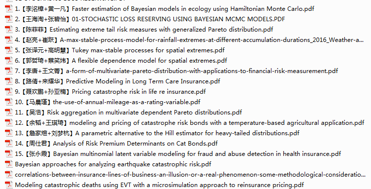

# Seminar - 2017

 

## 第二周
### [Stochastic loss reserving using bayesian MCMC models.pdf](https://github.com/lzx89757/Actuarial-Literatures/blob/master/papers/Stochastic%20loss%20reserving%20using%20bayesian%20MCMC%20models.pdf)

### [Modeling catastrophic deaths using EVT with a microsimulation approach to reinsurance pricing.pdf]

极值理论主要有两种方法

* 广义极值分布(Generalized Extreme Value Distribution，GEV)

  它们的分布必属于下列三种分布类型之一: Frechet，Weibull 和Gumber

* 广义帕累托分布(Generalized Pareto Distribution，GDP)

  该模型最早由 Pickands(1975)  年在极值理论的框架下引入的，POT 模型将所有超出给定充分大的门限值的观测值作为观测样本，研究观测样本大于门限值的量的渐进分布，该渐进分布为广义 Pareto  分布( Generalized Pareto Distribution，GPD) 。POT 模型作为巨灾损失拟合的工具，有其独特的优势，它不需要对整体的概率分布形式作假设，也不受整体分布的影响; 同时，POT 模型使用的一些极端损失数据受残缺性影响不大，因为极端值往往最令人关注，人们忽略它的可能性很小。

* ​

  ​

假设随机变量 $X_{1}, X_{2},...,X_{n}$ 为独立同分布的随机变量，分布函数表示为 $F(\cdot)​$